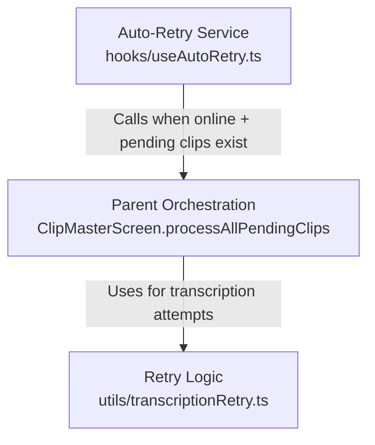

# 043_v3 Auto-Retry Architecture Implementation

## Overview

This plan implements a production-ready auto-retry system for pending clips following industry best practices:

- Event-driven auto-retry at app root (survives navigation)
- Shared retry logic (3 rapid + 3 interval attempts)
- Parent rotation with VPN-awareness
- Audio retrieval retries (3 attempts before marking corrupted)
- Two permanent error states (audio-corrupted, no-audio-detected)
- Memory leak prevention (cleanup on manual deletion)

## Architecture (3 Separate Concerns)




## Pre-Implementation Requirements

- ✅ All 3 concerns from 043_v3_CONCERN_RESPONSES.md verified
- ✅ `getClipById` exists in clipStore.ts (Line 157)
- ✅ `/api/clipperstream/format-text` accepts `existingFormattedContext`
- ✅ Pages Router confirmed (src/pages/_app.tsx)
- ✅ No circular dependencies
- ✅ All import paths verified

## Implementation Steps

### Step 0: Create Git Checkpoint (MANDATORY)

**BEFORE any implementation**, create rollback point:

```bash
git add .
git commit -m "Pre-043_v3: Checkpoint before auto-retry implementation"
git tag pre-043_v3
git log --oneline -1  # Verify
git tag               # Verify
```

**Restore command** (if needed later):

```bash
git reset --hard pre-043_v3
```

---

### Step 1: Update Zustand Store (Foundation)

**File**: [`src/projects/clipperstream/store/clipStore.ts`](src/projects/clipperstream/store/clipStore.ts)

#### 1a. Update ClipStatus Type

**Find** (around Line 10-16):

```typescript
export type ClipStatus =
  | null
  | 'transcribing'
  | 'formatting'
  | 'pending-child'
  | 'pending-retry'
  | 'failed';
```

**Replace with**:

```typescript
export type ClipStatus =
  | null                 // Done (completed)
  | 'transcribing'       // HTTP call in progress
  | 'formatting'         // Formatting API in progress
  | 'pending-child'      // Offline recording waiting to transcribe
  | 'pending-retry'      // Online but retrying after failures
  | 'audio-corrupted'    // ✅ NEW: Audio retrieval failed from IndexedDB (permanent)
  | 'no-audio-detected'; // ✅ NEW: No speech detected (permanent)
```

**Note**: Removed `'failed'` - replaced by `'audio-corrupted'` and `'no-audio-detected'`

#### 1b. Add lastError to Clip Interface

**Find** the Clip interface (around Line 18-55)**Add after `transcriptionError` field**:

```typescript
interface Clip {
  // ... existing fields ...
  transcriptionError?: string;  // ✅ ALREADY EXISTS
  lastError?: 'dns-block' | 'api-down' | 'network' | 'validation' | null;  // ✅ ADD THIS
  // ... rest of fields ...
}
```


#### 1c. Add processAllPendingClips to ClipStore Interface

**Find** ClipStore interface (around Line 57-93)**Add**:

```typescript
interface ClipStore {
  // ... existing fields ...
  processAllPendingClips: () => Promise<void>;  // ✅ ADD THIS
}
```


#### 1d. Add Placeholder Implementation

**Find** store implementation (inside `create<ClipStore>`)**Add**:

```typescript
export const useClipStore = create<ClipStore>()(
  persist(
    (set, get) => ({
      // ... existing state ...

      // ✅ ADD THIS: Set by ClipMasterScreen on mount
      processAllPendingClips: async () => {
        console.warn('processAllPendingClips not initialized yet');
      },

      // ... rest of implementation ...
    }),
    // ... persistence config ...
  )
);
```

---

### Step 2: Update API Route (DNS Detection)

**File**: [`src/pages/api/clipperstream/transcribe.ts`](src/pages/api/clipperstream/transcribe.ts)**Find** the catch block (around Line 218)**Add DNS error detection BEFORE generic error handling**:

```typescript
} catch (error) {
  const errorMessage = error instanceof Error ? error.message : '';

  // ✅ NEW: Detect DNS errors on server (VPN blocking)
  if (
    errorMessage.includes('ENOTFOUND') ||
    errorMessage.includes('ECONNREFUSED') ||
    errorMessage.includes('getaddrinfo') ||
    errorMessage.includes('DNS')
  ) {
    console.error('[API] DNS error - VPN or network blocking Deepgram:', errorMessage);

    // Return 503 with specific error type
    return res.status(503).json({
      error: 'dns-block',
      message: 'Cannot reach transcription API. Check VPN or network settings.'
    });
  }

  // API key issues (from Deepgram)
  if (errorMessage.includes('Unauthorized') || errorMessage.includes('401')) {
    return res.status(401).json({
      error: 'api-key-issue',
      message: 'Invalid API key'
    });
  }

  // ✅ EXISTING: Generic server error (keep existing code)
  console.error('[API] Transcription error:', error);
  return res.status(500).json({
    error: 'transcription-failed',
    message: errorMessage || 'Transcription failed'
  });
}
```

---

### Step 3: Create Shared Retry Logic

**File**: [`src/projects/clipperstream/utils/transcriptionRetry.ts`](src/projects/clipperstream/utils/transcriptionRetry.ts) **(NEW)Create new file** with full content from spec Lines 300-536:**Key components**:

- `TranscriptionResult` interface (with all error types: 'dns-block', 'api-down', etc.)
- `RetryOptions` interface
- `attemptTranscription()` function (3 rapid + 3 interval attempts)
- `transcribeSingle()` function (server-side DNS detection)
- `sleep()` utility

**Copy exact code from spec Lines 300-536**.---

### Step 4: Update useClipRecording Hook

**File**: [`src/projects/clipperstream/hooks/useClipRecording.ts`](src/projects/clipperstream/hooks/useClipRecording.ts)**Find** TranscriptionResult definition (around Line 16-19)**Replace**:

```typescript
// OLD - DELETE THIS:
// export interface TranscriptionResult {
//   text: string;
//   error: 'network' | 'validation' | 'server-error' | 'offline' | null;
// }
```

**With**:

```typescript
// ✅ CRITICAL: Import from transcriptionRetry to share type definition
import { TranscriptionResult } from '../utils/transcriptionRetry';
```

---

### Step 5: Create Auto-Retry Hook

**File**: [`src/projects/clipperstream/hooks/useAutoRetry.ts`](src/projects/clipperstream/hooks/useAutoRetry.ts) **(NEW)Create new file** with full content from spec Lines 155-232.**Key features**:

- SSR-safe navigator.onLine check
- Race condition guard (isHandlingOnlineEvent)
- Event-driven (online/offline events)
- Memory leak fix (removeEventListener in cleanup)

**Copy exact code from spec Lines 155-232**.---

### Step 6: Update ClipMasterScreen (COMPLEX)

**File**: [`src/projects/clipperstream/components/ui/ClipMasterScreen.tsx`](src/projects/clipperstream/components/ui/ClipMasterScreen.tsx)This is the largest change with multiple sub-steps:

#### 6a. Add Imports at Top

**Add after existing imports**:

```typescript
// ✅ NEW IMPORTS for 043_v3
import { attemptTranscription, TranscriptionResult } from '../../utils/transcriptionRetry';
import { getAudio, deleteAudio } from '../../services/audioStorage';
```

**Note**: `getAudio` may already be imported - check first

#### 6b. Add Module-Level Guards

**Add BEFORE component definition**:

```typescript
// ✅ NEW: Race condition guard (module-level)
let isProcessingPending = false;

// ✅ NEW: Track audio retrieval failures to avoid immediate deletion
const audioRetrievalAttempts = new Map<string, number>();
```


#### 6c. Add formatChildTranscription Function

**Add inside component** (near other callbacks like `handleDoneClick`):

```typescript
// ✅ NEW: Format transcription using API route (client-safe)
const formatChildTranscription = useCallback(async (
  clipId: string,
  rawText: string,
  existingContext?: string
): Promise<string> => {
  try {
    const response = await fetch('/api/clipperstream/format-text', {
      method: 'POST',
      headers: { 'Content-Type': 'application/json' },
      body: JSON.stringify({
        rawText,
        existingFormattedContext: existingContext
      })
    });

    if (!response.ok) {
      console.error('Formatting API failed', { status: response.status });
      return rawText;  // Fallback to raw
    }

    const data = await response.json();
    return data.formattedText || rawText;
  } catch (error) {
    console.error('Formatting failed', error);
    return rawText;  // Fallback to raw
  }
}, []);
```


#### 6d. Add processAllPendingClips Function

**Add inside component** (large function - ~230 lines):**Copy exact code from spec Lines 673-902** (processAllPendingClips + helper function).**Key features**:

- Race condition guard (mutex)
- Parent rotation logic
- Audio retrieval retries (3 attempts)
- VPN-aware (don't rotate on DNS errors)
- Continuous retry (no max attempts)
- Two permanent error states (audio-corrupted, no-audio-detected)

#### 6e. Add Memory Leak Cleanup to Delete Handlers

**⚠️ CRITICAL ADDITION** (from 043_v3_CONCERN_RESPONSES.md):**Find ALL calls to `deleteClip(id)` in ClipMasterScreen.tsxAdd cleanup BEFORE each deleteClip call**:

```typescript
// Pattern:
audioRetrievalAttempts.delete(clipId);  // ✅ ADD THIS LINE
deleteClip(clipId);                      // Existing line
```

**Example locations to check**:

- `handleDeleteClip` (if exists)
- `handleDeleteParent` (if exists)
- Any `onDelete` callbacks

**For parent deletion** (cascade delete):

```typescript
const handleDeleteParent = useCallback((parentId: string) => {
  const children = clips.filter(c => c.parentId === parentId);

  // ✅ Clean up tracking for parent + all children
  audioRetrievalAttempts.delete(parentId);
  children.forEach(child => audioRetrievalAttempts.delete(child.id));

  // Delete all children, then parent
  children.forEach(child => deleteClip(child.id));
  deleteClip(parentId);
}, [clips, deleteClip]);
```

**For child deletion** (conditional parent delete):

```typescript
const handleDeleteChild = useCallback((childId: string) => {
  const child = clips.find(c => c.id === childId);
  if (!child?.parentId) return;

  // Check if this is the ONLY child
  const siblings = clips.filter(c =>
    c.parentId === child.parentId && c.id !== childId
  );

  if (siblings.length === 0) {
    // Only child - delete parent too
    audioRetrievalAttempts.delete(childId);
    audioRetrievalAttempts.delete(child.parentId);
    deleteClip(childId);
    deleteClip(child.parentId);
  } else {
    // Has siblings - just delete child
    audioRetrievalAttempts.delete(childId);
    deleteClip(childId);
  }
}, [clips, deleteClip]);
```


#### 6f. Register processAllPendingClips with Store

**Add useEffect** (after processAllPendingClips definition):

```typescript
// ✅ NEW: Register function with Zustand store
useEffect(() => {
  useClipStore.setState({ processAllPendingClips });

  return () => {
    // Clean up on unmount
    useClipStore.setState({
      processAllPendingClips: async () => {
        console.warn('processAllPendingClips called after ClipMasterScreen unmounted');
      }
    });
  };
}, [processAllPendingClips]);
```


#### 6g. Update handleDoneClick (Live Recording)

**Find** existing `handleDoneClick` (around Line 476)**Find the transcription logic** and **replace** with:

```typescript
// ✅ UPDATED: Use shared retry logic
const result = await attemptTranscription(recordedBlob, {
  maxRapidAttempts: 3,
  useIntervals: false,  // Live recording: 3 attempts only, no intervals
});

// ✅ UPDATED: Handle new return type
if (result.text && result.text.length > 0) {
  // SUCCESS - Format and save
  console.log('[HandleDone] Transcription succeeded');

  // ... existing save logic (keep as-is) ...

} else {
  // FAILURE - Handle based on error type
  console.error('[HandleDone] Transcription failed', { error: result.error });

  if (result.error === 'dns-block') {
    // VPN detected - create pending clip
    console.log('[HandleDone] VPN blocking transcription, saving as pending');
    // ... existing pending clip creation logic ...

  } else if (result.error === 'server-error') {
    // Show server error toast
    setShowErrorToast(true);
    setRecordNavState('record');

  } else {
    // Generic error - still create pending clip to retry later
    console.log('[HandleDone] Transcription failed, saving as pending');
    // ... existing pending clip creation logic ...
  }
}
```


#### 6h. Remove Old handleOnline useEffect

**Find and DELETE** old `handleOnline` useEffect (if exists around Lines 1195-1247).This is now replaced by the auto-retry service at app root.---

### Step 7: Mount Auto-Retry at App Root

**File**: [`src/pages/_app.tsx`](src/pages/_app.tsx)

#### Current Code (Lines 1-19):

```typescript
import "@/styles/globals.css";
import type { AppProps } from "next/app";
import { LoadingProvider } from '@/contexts/LoadingContext';
import Head from 'next/head';

export default function App({ Component, pageProps }: AppProps) {
  return (
    <LoadingProvider>
      <Head>
        <meta
          name="viewport"
          content="width=device-width, initial-scale=1.0, viewport-fit=cover, maximum-scale=1.0"
        />
      </Head>
      <Component {...pageProps} />
    </LoadingProvider>
  );
}
```


#### Updated Code:

**Add imports** at top:

```typescript
// ✅ NEW: Import auto-retry service and Zustand store
import { useAutoRetry } from '@/projects/clipperstream/hooks/useAutoRetry';
import { useClipStore } from '@/projects/clipperstream/store/clipStore';
```

**Add inside App component** (before return statement):

```typescript
// ✅ NEW: Get processAllPendingClips from Zustand store
const processAllPendingClips = useClipStore(state => state.processAllPendingClips);

// ✅ NEW: Mount auto-retry service (runs for entire app lifetime)
useAutoRetry(processAllPendingClips);
```

**Complete modified file**:

```typescript
import "@/styles/globals.css";
import type { AppProps } from "next/app";
import { LoadingProvider } from '@/contexts/LoadingContext';
import Head from 'next/head';
// ✅ NEW
import { useAutoRetry } from '@/projects/clipperstream/hooks/useAutoRetry';
import { useClipStore } from '@/projects/clipperstream/store/clipStore';

export default function App({ Component, pageProps }: AppProps) {
  // ✅ NEW
  const processAllPendingClips = useClipStore(state => state.processAllPendingClips);
  useAutoRetry(processAllPendingClips);

  return (
    <LoadingProvider>
      <Head>
        <meta
          name="viewport"
          content="width=device-width, initial-scale=1.0, viewport-fit=cover, maximum-scale=1.0"
        />
      </Head>
      <Component {...pageProps} />
    </LoadingProvider>
  );
}
```

---

## Testing Checklist

After implementation, verify:

1. **Offline Recording → Come Online**

- Record offline → Should create pending clip
- Go online → Auto-retry should start automatically
- Verify clip transcribes successfully

2. **VPN Blocking**

- Turn on VPN → Record → Should detect DNS error
- All pending clips should show "Blocked by VPN" (orange)
- Turn off VPN → Should retry and succeed

3. **Parent Rotation**

- Create multiple parents with pending clips
- Verify fair rotation (processes each parent sequentially)
- Verify doesn't skip parents

4. **Live Recording**

- Record while online → Should attempt 3 times only (no intervals)
- Verify no interval waits for live recordings

5. **Concurrent Retry Protection**

- Toggle WiFi on/off rapidly
- Verify mutex prevents concurrent execution
- Check console for "Already processing, skipping duplicate call"

6. **Audio Retrieval Failure**

- Simulate IndexedDB corruption (manually delete audio)
- Verify 3 retry attempts before marking 'audio-corrupted'
- Verify red error UI shows

7. **No Audio Detected**

- Record silent audio → Should mark 'no-audio-detected'
- Verify white DeleteIcon, no retry button
- Verify NOT shown on home screen

8. **Manual Deletion (Memory Leak Prevention)**

- Create pending clips
- Manually delete them via UI
- Verify `audioRetrievalAttempts` Map is cleaned up
- Use Chrome DevTools to check Map size

9. **Navigator.onLine**

- Go offline → All pending clips should show "Waiting to transcribe"
- Go online → Should auto-retry

---

## Files Modified Summary

| File | Action | Lines | Priority |

|------|--------|-------|----------|

| `store/clipStore.ts` | MODIFY | +15 | 1 |

| `/api/clipperstream/transcribe.ts` | MODIFY | +25 | 2 |

| `utils/transcriptionRetry.ts` | CREATE | ~200 | 3 |

| `hooks/useClipRecording.ts` | MODIFY | -5, +1 | 4 |

| `hooks/useAutoRetry.ts` | CREATE | ~60 | 5 |

| `ClipMasterScreen.tsx` | MODIFY | -53, +250 | 6 |

| `_app.tsx` | MODIFY | +5 | 7 |**Total**: ~492 lines (production-ready code)---

## Critical Deletion Behavior Rules

### Rule #1: Cascade Delete (Parent → Children)

- **Trigger**: User deletes parent clip
- **Behavior**: Delete ALL children, even if actively transcribing
- **Why**: Transcription result has nowhere to go if parent deleted
- **Cleanup**: `audioRetrievalAttempts.delete()` for parent + all children

### Rule #2: Conditional Parent Delete (Child → Parent)

- **Trigger**: User deletes permanent error child ('audio-corrupted' or 'no-audio-detected')
- **Condition**: Child is the ONLY pending clip in parent
- **Behavior**: Delete both child AND parent
- **Why**: Parent has no content if only child is permanent error

### Rule #3: Abort on Parent Delete

- **Scenario**: Parent deleted while child is actively transcribing
- **Behavior**: Deletion implicitly aborts transcription
- **Why**: Next iteration of processAllPendingClips checks if clip still exists
- **Note**: No explicit abort needed - deletion removes from queue

---

## Rollback Instructions

If issues arise:

```bash
# Reset to pre-implementation state
git reset --hard pre-043_v3

# Verify rollback
git log --oneline -1
```

---

## Next Phase (After 043_v3 Works)

1. ✅ Verify all tests pass
2. ⏳ Implement v1.50 - Circuit breaker + Whisper fallback