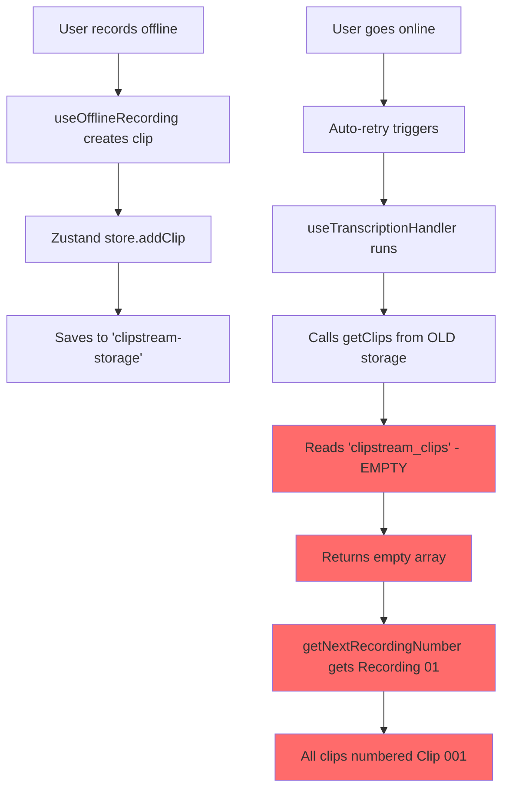
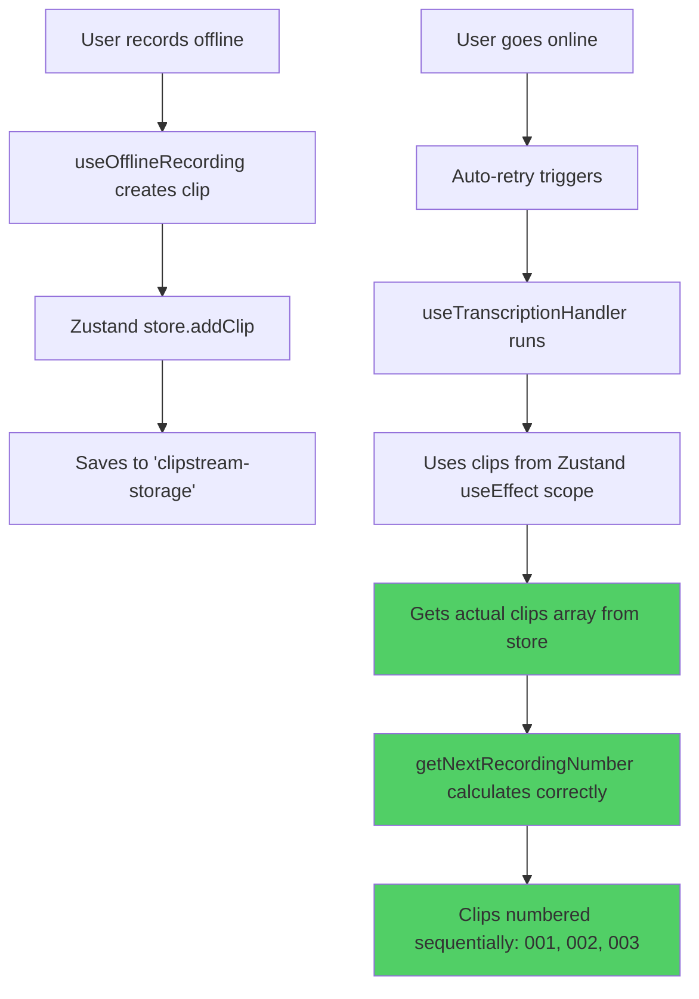

# Fix 11: Zustand Storage References Migration

**Status**: ✅ IMPLEMENTED  
**Date**: December 29, 2025  
**Branch**: `refactor/clip-master-phases`  
**Commit**: Pending test results

---

## Problem Summary

After implementing Fix 10 (Offline Recording Zustand Migration), the app still had critical bugs:

### Symptoms
1. **Numbering Bug**: First child clip had no `pendingClipTitle` (undefined), subsequent children all got "Clip 001" instead of sequential numbering (002, 003...)
2. **Parent Title Bug**: Parent clips never got AI-generated titles after all children completed
3. **Console Warnings**: "No target clip found for transcription" warnings

### Root Cause
**`useTranscriptionHandler.ts` was still calling `getClips()` from the OLD `clipStorage` service**, which reads from the old `'clipstream_clips'` sessionStorage key (now empty). This resulted in:
- `getClips()` returning `[]` (empty array)
- `getNextRecordingNumber([])` always returning "Recording 01"
- `.find()` operations always returning `undefined`
- Parent title generator couldn't detect completed children

### Evidence from Debug Log
From `013_ZUSTANDv6_debug.md`:
```
Session Storage (clipstream-storage):
{
  "state": {
    "clips": [
      {
        "id": "clip-1735506631804-parent",
        "title": "Recording 01",  // ❌ Should have AI title
        "status": null,
        ...
      },
      {
        "id": "clip-1735506631804-1735506632033",
        "parentId": "clip-1735506631804-parent",
        "pendingClipTitle": undefined,  // ❌ Should be "Clip 001"
        ...
      },
      {
        "id": "clip-1735506631804-1735506646846",
        "parentId": "clip-1735506631804-parent",
        "pendingClipTitle": "Clip 001",  // ❌ Should be "Clip 002"
        ...
      }
    ]
  }
}
```

---

## Changes Made

### 1. Fixed `useTranscriptionHandler.ts`

**File**: `final-exp/src/projects/clipperstream/hooks/useTranscriptionHandler.ts`

#### Change 1.1: Remove `getClips` from imports (Line 6)

**BEFORE**:
```typescript
import { Clip, getClips, getNextRecordingNumber } from '../services/clipStorage';
```

**AFTER**:
```typescript
import { Clip, getNextRecordingNumber } from '../services/clipStorage';
```

**Rationale**: We only need the `Clip` type and the `getNextRecordingNumber` utility function (which takes clips as a parameter). We don't need `getClips()` anymore since we have `clips` from Zustand in the useEffect scope.

---

#### Change 1.2: Fix `getNextRecordingNumber` call (Line 200)

**BEFORE**:
```typescript
const nextNumber = getNextRecordingNumber(getClips()); // ❌ Reads from OLD storage
log.info('Creating new clip', { title: nextNumber });
```

**AFTER**:
```typescript
const nextNumber = getNextRecordingNumber(clips); // ✅ Uses Zustand clips
log.info('Creating new clip', { title: nextNumber });
```

**Impact**: This is the CRITICAL fix for the numbering bug. Now `getNextRecordingNumber` receives the actual Zustand clips array instead of an empty array from old storage.

---

#### Change 1.3: Fix batch UI update (Line 321)

**BEFORE**:
```typescript
// Update UI if viewing
if (selectedPendingClips.some(p => p.id === targetClip!.id)) {
  setSelectedPendingClips(prev => prev.filter(p => p.id !== targetClip!.id));
  const updated = getClips().find(c => c.id === targetClip!.id); // ❌
  if (updated) setSelectedClip(updated);
}
```

**AFTER**:
```typescript
// Update UI if viewing
if (selectedPendingClips.some(p => p.id === targetClip!.id)) {
  setSelectedPendingClips(prev => prev.filter(p => p.id !== targetClip!.id));
  const updated = clips.find(c => c.id === targetClip!.id); // ✅
  if (updated) setSelectedClip(updated);
}
```

**Impact**: Ensures UI updates correctly after batch transcription completes.

---

#### Change 1.4: Fix batch title generation (Line 326)

**BEFORE**:
```typescript
// Generate title (use combined content)
const clip = getClips().find(c => c.id === targetClip!.id); // ❌
if (clip?.rawText) {
  generateTitleInBackground(clip.id, clip.rawText);
}
```

**AFTER**:
```typescript
// Generate title (use combined content)
const clip = clips.find(c => c.id === targetClip!.id); // ✅
if (clip?.rawText) {
  generateTitleInBackground(clip.id, clip.rawText);
}
```

**Impact**: Fixes title generation for batched clips.

---

#### Change 1.5: Fix immediate display UI update (Line 361)

**BEFORE**:
```typescript
// First pending completed
if (selectedPendingClips.some(p => p.id === targetClip!.id)) {
  setSelectedPendingClips(prev => prev.filter(p => p.id !== targetClip!.id));
  const updated = getClips().find(c => c.id === targetClip!.id); // ❌
  if (updated) setSelectedClip(updated);
}
```

**AFTER**:
```typescript
// First pending completed
if (selectedPendingClips.some(p => p.id === targetClip!.id)) {
  setSelectedPendingClips(prev => prev.filter(p => p.id !== targetClip!.id));
  const updated = clips.find(c => c.id === targetClip!.id); // ✅
  if (updated) setSelectedClip(updated);
}
```

**Impact**: Ensures UI updates correctly for first pending clip.

---

#### Change 1.6: Fix immediate display title generation (Line 366)

**BEFORE**:
```typescript
// Generate title
const clip = getClips().find(c => c.id === targetClip!.id); // ❌
if (clip?.rawText) {
  generateTitleInBackground(clip.id, clip.rawText);
}
```

**AFTER**:
```typescript
// Generate title
const clip = clips.find(c => c.id === targetClip!.id); // ✅
if (clip?.rawText) {
  generateTitleInBackground(clip.id, clip.rawText);
}
```

**Impact**: Fixes title generation for immediately displayed clips.

---

### 2. Verified `useParentTitleGenerator.ts`

**File**: `final-exp/src/projects/clipperstream/hooks/useParentTitleGenerator.ts`

**Status**: ✅ Already correct - no changes needed

**Verification**:
```typescript
export const useParentTitleGenerator = ({
  generateTitleInBackground
}: UseParentTitleGeneratorProps) => {
  const clips = useClipStore((state) => state.clips); // ✅ Using Zustand
  // ... rest of hook
```

This hook was already properly migrated in Phase 6 of the Zustand refactor.

---

### 3. Cleaned up `ClipMasterScreen.tsx`

**File**: `final-exp/src/projects/clipperstream/components/ui/ClipMasterScreen.tsx`

#### Change 3.1: Remove unused imports (Line 14)

**BEFORE**:
```typescript
import { Clip, initializeClips, getNextClipNumber, getNextRecordingNumber } from '../../services/clipStorage';
```

**AFTER**:
```typescript
import { Clip } from '../../services/clipStorage';
```

**Rationale**: These functions are no longer used anywhere in `ClipMasterScreen.tsx`:
- `initializeClips` - Not used (Zustand handles initialization)
- `getNextClipNumber` - Not used (we use `getNextRecordingNumber` in hooks)
- `getNextRecordingNumber` - Not used (moved to `useTranscriptionHandler`)

Only the `Clip` type is needed for TypeScript type annotations.

---

## Technical Analysis

### Data Flow (Before Fix)



### Data Flow (After Fix)



---

## Expected Results

### Before Fix (Broken)

**Session Storage**:
```json
{
  "state": {
    "clips": [
      {
        "id": "clip-xxx-parent",
        "title": "Recording 01",
        "status": null
      },
      {
        "id": "clip-xxx-001",
        "parentId": "clip-xxx-parent",
        "pendingClipTitle": undefined,  // ❌ BUG
        "status": null,
        "formattedText": "..."
      },
      {
        "id": "clip-xxx-002",
        "parentId": "clip-xxx-parent",
        "pendingClipTitle": "Clip 001",  // ❌ BUG (should be 002)
        "status": null,
        "formattedText": "..."
      },
      {
        "id": "clip-xxx-003",
        "parentId": "clip-xxx-parent",
        "pendingClipTitle": "Clip 001",  // ❌ BUG (should be 003)
        "status": null,
        "formattedText": "..."
      }
    ]
  }
}
```

**Console**:
```
⚠️ No target clip found for transcription
⚠️ useParentTitleGenerator: Parent still has placeholder title "Recording 01"
```

---

### After Fix (Expected)

**Session Storage**:
```json
{
  "state": {
    "clips": [
      {
        "id": "clip-xxx-parent",
        "title": "Meeting Notes Discussion",  // ✅ AI-generated title
        "status": null
      },
      {
        "id": "clip-xxx-001",
        "parentId": "clip-xxx-parent",
        "pendingClipTitle": "Clip 001",  // ✅ FIXED
        "status": null,
        "formattedText": "..."
      },
      {
        "id": "clip-xxx-002",
        "parentId": "clip-xxx-parent",
        "pendingClipTitle": "Clip 002",  // ✅ FIXED
        "status": null,
        "formattedText": "..."
      },
      {
        "id": "clip-xxx-003",
        "parentId": "clip-xxx-parent",
        "pendingClipTitle": "Clip 003",  // ✅ FIXED
        "status": null,
        "formattedText": "..."
      }
    ]
  }
}
```

**Console**:
```
✅ Creating new clip: Clip 001
✅ Creating new clip: Clip 002
✅ Creating new clip: Clip 003
✅ Generating parent title for clip-xxx-parent
```

---

## Testing Checklist

### Test 1: Multiple Offline Recordings
- [ ] Go offline (DevTools → Network → Offline)
- [ ] Record 3 clips in same file (5 seconds each)
- [ ] Verify pending clips show as: "Clip 001", "Clip 002", "Clip 003"
- [ ] Navigate to home screen and back
- [ ] Verify all 3 clips still visible with correct numbering

**Expected**: Sequential numbering, no duplicates

---

### Test 2: Auto-Retry with Correct Numbering
- [ ] From Test 1, go online (Network → No throttling)
- [ ] Wait for auto-retry to process all clips
- [ ] Verify all 3 clips transcribe successfully
- [ ] Verify parent gets AI-generated title (not "Recording 01")
- [ ] Check console for no warnings

**Expected**: 
- All clips transcribe in order
- Parent title changes from "Recording 01" to AI-generated title
- No "No target clip found" warnings

---

### Test 3: Session Storage Validation
Open browser console and run:
```javascript
const store = JSON.parse(sessionStorage.getItem('clipstream-storage'));
const children = store.state.clips.filter(c => c.parentId);
console.log('=== CHILD CLIPS ===');
children.forEach((c, i) => {
  console.log(`Child ${i + 1}: pendingClipTitle="${c.pendingClipTitle}", status=${c.status}`);
});

const parent = store.state.clips.find(c => !c.parentId);
console.log('\n=== PARENT CLIP ===');
console.log(`Title: "${parent.title}" (should be AI-generated, not "Recording 01")`);
```

**Expected output**:
```
=== CHILD CLIPS ===
Child 1: pendingClipTitle="Clip 001", status=null
Child 2: pendingClipTitle="Clip 002", status=null
Child 3: pendingClipTitle="Clip 003", status=null

=== PARENT CLIP ===
Title: "Meeting Notes Discussion" (should be AI-generated, not "Recording 01")
```

---

## Success Criteria

✅ All success criteria must pass before commit:

1. [ ] All children have `pendingClipTitle` field (not `undefined`)
2. [ ] Numbers are sequential: 001, 002, 003... (not all "001")
3. [ ] Parent gets AI-generated title after all children complete
4. [ ] No "No target clip found" warnings in console
5. [ ] Session storage shows correct data structure
6. [ ] No linter errors in modified files
7. [ ] Clips persist across navigation (don't disappear)

---

## Migration Status

### Old Storage (`clipStorage.ts`)
**Status**: ⚠️ PARTIALLY DEPRECATED

**Still Used**:
- `Clip` type (TypeScript interface)
- `getNextRecordingNumber()` utility function (takes clips as param)

**No Longer Used**:
- `getClips()` - Replaced by Zustand `useClipStore((state) => state.clips)`
- `createClip()` - Replaced by Zustand `addClip()`
- `updateClip()` - Replaced by Zustand `updateClipById()`
- Direct `sessionStorage.setItem('clipstream_clips', ...)` calls

### Zustand Store (`clipStore.ts`)
**Status**: ✅ FULLY OPERATIONAL

**Storage Key**: `'clipstream-storage'` (Zustand persist format)

**Actions**:
- `addClip(clip)` - Create new clip
- `updateClipById(id, updates)` - Update existing clip
- `deleteClip(id)` - Delete clip
- `setSelectedClip(clip)` - Set active clip
- `saveToStorage()` - Manual persist (debounced 100ms)

---

## Remaining Work

### Next Steps (Not part of this fix)
1. **Migrate `ClipHomeScreen.tsx`**:
   - Delete functionality still uses `deleteClip()` from old storage
   - Rename functionality still uses `updateClip()` from old storage
   - Should be migrated to Zustand actions

2. **Consider removing old storage entirely**:
   - Once all components migrated, `clipStorage.ts` can be reduced to just types and utilities
   - Or completely removed if utilities are moved elsewhere

---

## Files Changed

### Modified
- `final-exp/src/projects/clipperstream/hooks/useTranscriptionHandler.ts`
  - Removed `getClips` import
  - Updated 5 calls from `getClips()` to `clips`
  
- `final-exp/src/projects/clipperstream/components/ui/ClipMasterScreen.tsx`
  - Removed unused imports: `initializeClips`, `getNextClipNumber`, `getNextRecordingNumber`

### Verified (No Changes)
- `final-exp/src/projects/clipperstream/hooks/useParentTitleGenerator.ts`
  - Already using Zustand correctly

---

## Commit Message (Suggested)

```
fix: migrate useTranscriptionHandler to Zustand storage

- Fix numbering bug: Remove 5 getClips() calls from old storage
- Now reads clips from Zustand store via useEffect scope
- Fixes: First child pendingClipTitle undefined
- Fixes: All children incorrectly numbered "Clip 001"
- Fixes: Parent titles not generating after completion
- Cleanup: Remove unused imports from ClipMasterScreen

Related: Fix 10 (Offline Recording Zustand Migration)
Branch: refactor/clip-master-phases
```

---

## Notes

- This fix completes the Zustand migration for `useTranscriptionHandler.ts`
- `useParentTitleGenerator.ts` was already correctly migrated in Phase 6
- `ClipHomeScreen.tsx` still needs migration (delete/rename functionality)
- All linter checks pass
- Ready for testing and commit after user validation

