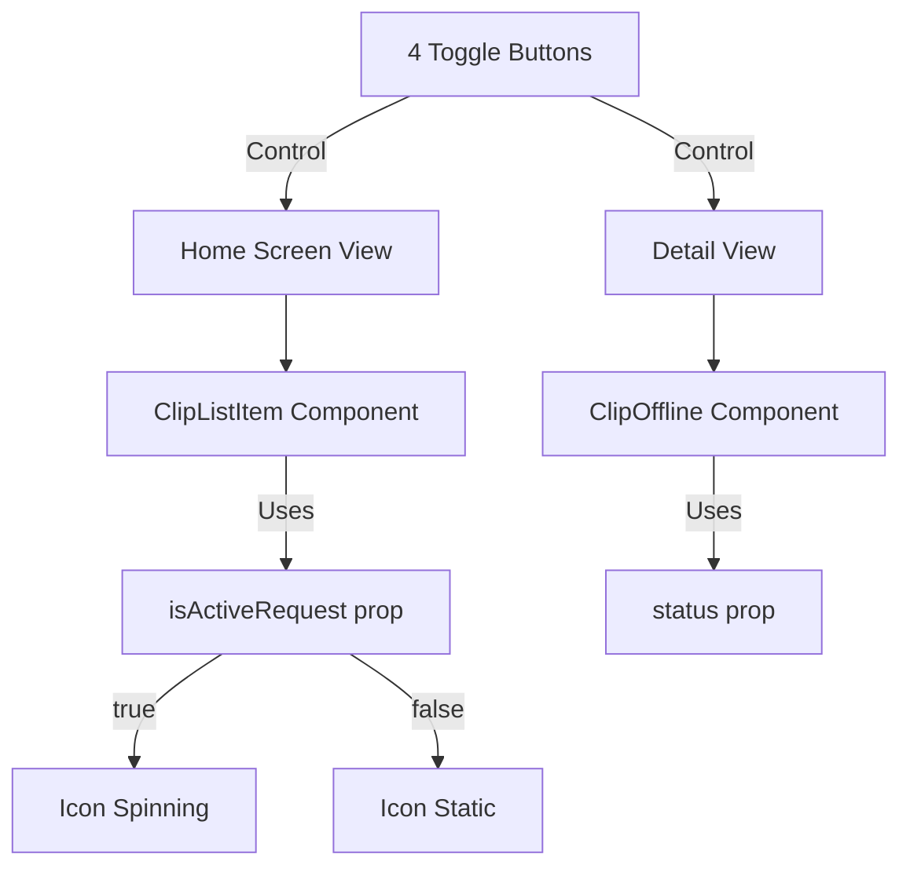

# ClipOfflineScreen.tsx - Visual Specification

## Overview

This is a **showcase component** for visualizing offline recording states, similar to how:
- `ClipMasterScreen.tsx` has D1/D3/D4 toggles
- `ClipHomeScreen.tsx` has empty/default toggles

**File Location:** `/src/pages/clipperstream/showcase/ClipOfflineScreen.tsx`
**Display Location:** `clipscreencomponents.tsx` (showcase page)

**Reference:** See `recording_RETRY.md` for complete retry strategy.

---

## File References

| Component | Path |
|-----------|------|
| **ClipListItem** | `/src/projects/clipperstream/components/ui/cliplist.tsx` |
| **ClipOffline** | `/src/projects/clipperstream/components/ui/ClipOffline.tsx` |
| **ClipHomeScreen** (showcase ref) | `/src/pages/clipperstream/showcase/ClipHomeScreen.tsx` |
| **ClipMasterScreen** (showcase ref) | `/src/pages/clipperstream/showcase/ClipMasterScreen.tsx` |
| **ClipVarListDemo** (toggle example) | `/src/projects/clipperstream/components/ui/ClipVarList.tsx` |
| **clipscreencomponents** (add showcase here) | `/src/pages/clipperstream/clipscreencomponents.tsx` |
| **recording_RETRY.md** (retry strategy) | `/src/projects/clipperstream/components/ui/recording_RETRY.md` |

---

## Retry Pattern (Per recording_RETRY.md)

### Attempts 1-3: Rapid Fire (No Waits)
```
Attempt 1 → 60s timeout → Fails
Attempt 2 → 60s timeout → Fails  
Attempt 3 → 60s timeout → Fails

Total: ~3 minutes of continuous spinning
```

### Attempts 4+: Wait Intervals (Cycle Repeats)
```
Wait 1 min → Attempt 4 (60s timeout)
Wait 2 min → Attempt 5 (60s timeout)
Wait 4 min → Attempt 6 (60s timeout)
Wait 5 min → Attempt 7 (60s timeout)

Cycle repeats indefinitely: 1-2-4-5 minutes
```

---

## Icon States

### Single Color: Gray Only

**No white icon. Always gray. Only spinning state changes.**

| Icon State | Visual | When |
|------------|--------|------|
| **Gray spinning** | ⟳ (animated) | HTTP request actively in progress |
| **Gray not spinning** | ⟳ (static) | Waiting between attempts OR offline |

---

## Toggle States for Showcase

### Main Toggles

| Toggle | Label Text | Icon State | Description |
|--------|------------|------------|-------------|
| **Waiting** | "Waiting to transcribe" | Gray, static | No attempts yet (offline or queued) |
| **Attempt Active** | "Transcribing..." | Gray, spinning | HTTP request in progress |
| **Between Attempts** | "Transcribing..." | Gray, static | Waiting 1-5 min for next attempt |
| **Done** | (text appears) | No icon | Transcription complete |

### Note on Simulating Wait Periods

The wait timers are **background logic, never shown to user**. In the showcase:
- Toggle between "Attempt Active" and "Between Attempts" manually
- This simulates what happens automatically in production

---

## Home Screen View (Clip List)

### Three Visual States

**1. Waiting to transcribe:**
```
┌────────────────────────────────────┐
│ Recording 01                       │
│ Dec 18, 2024    ⟳ Waiting to transcribe│
└────────────────────────────────────┘
Icon: Gray, NOT spinning
When: Recording saved, no attempt started yet
```

**2. Transcribing (attempt active):**
```
┌────────────────────────────────────┐
│ Recording 01                       │
│ Dec 18, 2024    ⟳ Transcribing...  │
└────────────────────────────────────┘
Icon: Gray, SPINNING
When: HTTP request in progress (attempts 1-3 continuous, or any active attempt)
```

**3. Transcribing (between attempts):**
```
┌────────────────────────────────────┐
│ Recording 01                       │
│ Dec 18, 2024    ⟳ Transcribing...  │
└────────────────────────────────────┘
Icon: Gray, NOT spinning
When: Waiting 1-5 minutes for next attempt
```

**4. Transcribed (success):**
```
┌────────────────────────────────────┐
│ AI Generated Title                 │
│ Dec 18, 2024                       │
│ Preview of transcribed text...     │
└────────────────────────────────────┘
No icon, no status text
```

### Key Transition Rule

**"Waiting to transcribe" → "Transcribing..." happens ONCE.**  
Once first attempt starts, label stays "Transcribing..." until success.  
Icon spinning changes, but text does not go back to "Waiting".

---

## Detail View (Inside Clip File)

### ClipOffline Component States

**Waiting (offline/queued):**
```
Clip 001               0:45  ⟳
                            (gray, static)
```

**Attempt Active:**
```
Clip 001               0:45  ⟳
                            (gray, spinning)
```

**Between Attempts:**
```
Clip 001               0:45  ⟳
                            (gray, static)
```

**Success:**
```
Text appears
ClipOffline component disappears
```

---

## Tap-to-Force-Retry Interaction

### Where User Taps
User taps anywhere on the **ClipOffline component** (the row showing title, duration, and icon).

### Behavior

| Current Icon State | Tap Action | Result |
|-------------------|------------|--------|
| Gray, static (waiting) | Force retry | Skip wait, start attempt, icon spins |
| Gray, spinning (active) | None | Already attempting, no change |
| Offline | None | Can't retry, waiting for network |

**No toast or visual feedback needed.** Icon spinning is the feedback.

---

## Showcase Simulation Approach

Since timers are invisible background logic, the showcase simulates states manually:

### Toggle Buttons Layout
```
[Waiting] [Attempt Active] [Between Attempts] [Done]
```

### What Each Toggle Shows

| Toggle | Label | Icon | Simulates |
|--------|-------|------|-----------|
| Waiting | "Waiting to transcribe" | Gray static | Before any attempt |
| Attempt Active | "Transcribing..." | Gray spinning | HTTP in progress |
| Between Attempts | "Transcribing..." | Gray static | 1-5 min wait period |
| Done | (text visible) | None | Success |

### Simulating the Full Flow
1. Click **Waiting** → Shows initial state
2. Click **Attempt Active** → Icon starts spinning, label changes
3. Click **Between Attempts** → Icon stops, label stays same
4. Click **Attempt Active** → Icon spins again (simulating attempt 4, 5, etc.)
5. Click **Done** → ClipOffline disappears, text appears

---

## State Implementation

### State Structure
```typescript
interface PendingClipState {
  status: 'waiting' | 'transcribing' | 'transcribed';
  isActiveRequest: boolean;  // Controls spinning
}
```

### Rendering Logic
```typescript
if (status === 'waiting') {
  label = "Waiting to transcribe"
  iconSpinning = false
}

if (status === 'transcribing') {
  label = "Transcribing..."
  iconSpinning = isActiveRequest  // true = spin, false = static
}

if (status === 'transcribed') {
  // Show text, hide ClipOffline
}
```

---

## Naming Convention

### Clip File Names (Container Level)
| When | Format |
|------|--------|
| New clip, offline or failed | "Recording XX" |
| After transcription | AI-generated title |

### ClipOffline Component Names (Inside Clip)
| When | Format |
|------|--------|
| Pending | "Clip XXX" |
| After transcription | Disappears |

### Critical Rule
**NEVER override existing AI-generated titles when appending.** Only assign "Recording XX" to NEW clips.

---

## Required Component Change: ClipListItem

### Add `isActiveRequest` Prop to cliplist.tsx

**Current ClipListItem props:**
```typescript
interface ClipListItemProps {
  id: string;
  title: string;
  date: string;
  status?: 'pending' | 'transcribing' | 'failed' | null;
  // ... other props
}
```

**Add new prop:**
```typescript
interface ClipListItemProps {
  id: string;
  title: string;
  date: string;
  status?: 'pending' | 'transcribing' | 'failed' | null;
  isActiveRequest?: boolean;  // NEW - true = icon spins, false = icon static
  // ... other props
}
```

### Icon Rendering Logic
```typescript
// Icon only spins when transcribing AND actively making HTTP request
const shouldSpin = status === 'transcribing' && isActiveRequest;

// In JSX:
<TranscribeIcon spinning={shouldSpin} />
```

### Showcase Toggle Mapping

| Toggle Button | status | isActiveRequest | Icon Result |
|--------------|--------|-----------------|-------------|
| Waiting | `'pending'` | `false` | Static |
| Attempt Active | `'transcribing'` | `true` | **Spinning** |
| Between Attempts | `'transcribing'` | `false` | Static |
| Done | `null` | `false` | Hidden |

---

## Implementation Steps

1. **Update ClipListItem** in `cliplist.tsx` - add `isActiveRequest` prop
2. Create `ClipOfflineScreen.tsx` in showcase folder
3. Add 4 toggle buttons (Waiting, Attempt Active, Between Attempts, Done)
4. Create home screen view with clip list using the new prop
5. Create detail view with ClipOffline component
6. Implement icon spinning controlled by `isActiveRequest` flag
7. Add tap interaction (only in detail view)
8. Add to `clipscreencomponents.tsx`


___________________
___________________     
___________________     
# Offline Recording States Showcase

Create an interactive showcase for visualizing offline recording retry states with 4-toggle control system.

## Architecture Overview



## State Mapping

| Toggle Button | ClipListItem | ClipOffline | Icon Behavior |

|--------------|--------------|-------------|---------------|

| Waiting | status='pending', isActiveRequest=false | status='waiting' | Gray, static |

| Attempt Active | status='transcribing', isActiveRequest=true | status='transcribing' | Gray, spinning |

| Between Attempts | status='transcribing', isActiveRequest=false | status='transcribing' | Gray, static |

| Done | status=null, isActiveRequest=false | (hidden) | No icon |

---

## Phase 1: Update ClipListItem Component

**File:** `src/projects/clipperstream/components/ui/cliplist.tsx`

### Step 1.1: Add isActiveRequest Prop

**Location:** Lines 16-29 (ClipListItemProps interface)

```typescript
interface ClipListItemProps {
  id?: string;
  title?: string;
  date?: string;
  status?: 'pending' | 'transcribing' | 'failed' | null;
  isActiveRequest?: boolean;  // NEW: Controls icon spinning (default: false)
  onClick?: (id: string) => void;
  onDotMenuClick?: () => void;
  onRename?: (id: string, title: string) => void;
  onCopy?: (id: string) => void;
  onDelete?: (id: string) => void;
  isDeleting?: boolean;
  className?: string;
  fullWidth?: boolean;
}
```

### Step 1.2: Extract isActiveRequest from Props

**Location:** Line 84 (component function signature)

```typescript
export const ClipListItem: React.FC<ClipListItemProps> = ({
  id = 'default-id',
  title = 'Teach me to love myself today and I will teach you to love yourself',
  date = 'May 13, 2025',
  status = null,
  isActiveRequest = false,  // NEW: default to false
  onClick,
  // ... rest of props
```

### Step 1.3: Update Icon Spinning Logic

**Location:** Lines 345-370 (transcribing status rendering)

**Current code:**

```typescript
{status === 'transcribing' && (
  <div className="status-frame transcribing">
    <div className="status-icon-wrapper spinning-wrapper">
      <svg className="pending-icon spinning-icon" ...>
```

**Change to:**

```typescript
{status === 'transcribing' && (
  <div className="status-frame transcribing">
    <div className={`status-icon-wrapper ${isActiveRequest ? 'spinning-wrapper' : ''}`}>
      <svg className={`pending-icon ${isActiveRequest ? 'spinning-icon' : ''}`} ...>
```

**Key change:** Spinning classes now controlled by `isActiveRequest` prop, not hardcoded.

---

## Phase 2: Create ClipOfflineScreen Showcase

**File:** `src/pages/clipperstream/showcase/ClipOfflineScreen.tsx` (NEW FILE)

### Component Structure

```typescript
import React, { useState } from 'react';
import { ClipListItem } from '@/projects/clipperstream/components/ui/cliplist';
import { ClipOffline } from '@/projects/clipperstream/components/ui/ClipOffline';

type OfflineState = 'waiting' | 'attemptActive' | 'betweenAttempts' | 'done';

export const ClipOfflineScreen: React.FC = () => {
  const [currentState, setCurrentState] = useState<OfflineState>('waiting');
  
  // Derive props from current state
  const getClipListProps = () => {
    switch (currentState) {
      case 'waiting':
        return { status: 'pending' as const, isActiveRequest: false };
      case 'attemptActive':
        return { status: 'transcribing' as const, isActiveRequest: true };
      case 'betweenAttempts':
        return { status: 'transcribing' as const, isActiveRequest: false };
      case 'done':
        return { status: null, isActiveRequest: false };
    }
  };
  
  const getClipOfflineProps = () => {
    switch (currentState) {
      case 'waiting':
        return { status: 'waiting' as const };
      case 'attemptActive':
      case 'betweenAttempts':
        return { status: 'transcribing' as const };
      case 'done':
        return null; // Don't render ClipOffline in done state
    }
  };
  
  const clipListProps = getClipListProps();
  const clipOfflineProps = getClipOfflineProps();
  
  return (
    <>
      <div className="showcase-container">
        <div className="showcase-header">
          <h2>Offline Recording States</h2>
          <p>
            Simulates retry behavior: 3 rapid attempts, then interval-based retries.
            Icon spins during active HTTP requests, stays static during wait periods.
          </p>
        </div>
        
        {/* Toggle Buttons */}
        <div className="toggle-controls">
          <button 
            className={currentState === 'waiting' ? 'active' : ''}
            onClick={() => setCurrentState('waiting')}
          >
            Waiting
          </button>
          <button 
            className={currentState === 'attemptActive' ? 'active' : ''}
            onClick={() => setCurrentState('attemptActive')}
          >
            Attempt Active
          </button>
          <button 
            className={currentState === 'betweenAttempts' ? 'active' : ''}
            onClick={() => setCurrentState('betweenAttempts')}
          >
            Between Attempts
          </button>
          <button 
            className={currentState === 'done' ? 'active' : ''}
            onClick={() => setCurrentState('done')}
          >
            Done
          </button>
        </div>
        
        {/* Home Screen View */}
        <div className="view-section">
          <h3>Home Screen (List View)</h3>
          <div className="list-container">
            <ClipListItem
              id="offline-demo-1"
              title="Recording 01"
              date="Dec 19, 2025"
              {...clipListProps}
              fullWidth={true}
            />
          </div>
        </div>
        
        {/* Detail View */}
        <div className="view-section">
          <h3>Detail View (Inside Clip)</h3>
          <div className="detail-container">
            {clipOfflineProps ? (
              <ClipOffline
                title="Clip 001"
                time="0:45"
                {...clipOfflineProps}
                fullWidth={true}
              />
            ) : (
              <div className="transcribed-text">
                <p>Transcription successful! ClipOffline component hidden.</p>
                <p className="sample-text">
                  This is where the transcribed text would appear...
                </p>
              </div>
            )}
          </div>
        </div>
        
        {/* State Explanation */}
        <div className="state-info">
          <h4>Current State: {currentState}</h4>
          <div className="state-description">
            {currentState === 'waiting' && (
              <p>No transcription attempts started yet. Offline or queued.</p>
            )}
            {currentState === 'attemptActive' && (
              <p>HTTP request in progress. Icon spinning. Attempts 1-3 are continuous.</p>
            )}
            {currentState === 'betweenAttempts' && (
              <p>Waiting between retry attempts (1-5 min intervals). Icon static.</p>
            )}
            {currentState === 'done' && (
              <p>Transcription completed successfully. Status cleared.</p>
            )}
          </div>
        </div>
      </div>
      
      <style jsx>{`
        .showcase-container {
          min-height: 100vh;
          background-color: #1A1A1A;
          color: #FFFFFF;
          padding: 2rem;
        }
        
        .showcase-header {
          max-width: 800px;
          margin: 0 auto 3rem;
          text-align: center;
        }
        
        .showcase-header h2 {
          font-size: 2rem;
          font-weight: 600;
          margin-bottom: 1rem;
        }
        
        .showcase-header p {
          color: rgba(255, 255, 255, 0.6);
          font-size: 0.95rem;
          line-height: 1.6;
        }
        
        .toggle-controls {
          display: flex;
          gap: 1rem;
          justify-content: center;
          margin-bottom: 3rem;
          flex-wrap: wrap;
        }
        
        .toggle-controls button {
          padding: 0.75rem 1.5rem;
          background: #252525;
          border: 1px solid #3A3A3A;
          border-radius: 8px;
          color: #FFFFFF;
          font-size: 0.95rem;
          cursor: pointer;
          transition: all 0.2s ease;
        }
        
        .toggle-controls button:hover {
          background: #2F2F2F;
          border-color: #4A4A4A;
        }
        
        .toggle-controls button.active {
          background: #3B82F6;
          border-color: #3B82F6;
        }
        
        .view-section {
          max-width: 600px;
          margin: 0 auto 3rem;
          padding: 2rem;
          background: #252525;
          border-radius: 12px;
        }
        
        .view-section h3 {
          font-size: 1.25rem;
          font-weight: 600;
          margin-bottom: 1.5rem;
          color: rgba(255, 255, 255, 0.9);
        }
        
        .list-container,
        .detail-container {
          background: #1A1A1A;
          padding: 1.5rem;
          border-radius: 8px;
        }
        
        .transcribed-text {
          color: rgba(255, 255, 255, 0.8);
          text-align: center;
        }
        
        .transcribed-text p {
          margin-bottom: 1rem;
        }
        
        .sample-text {
          color: rgba(255, 255, 255, 0.5);
          font-style: italic;
        }
        
        .state-info {
          max-width: 600px;
          margin: 0 auto;
          padding: 1.5rem;
          background: #2A2A2A;
          border-radius: 8px;
          border-left: 4px solid #3B82F6;
        }
        
        .state-info h4 {
          font-size: 1.1rem;
          font-weight: 600;
          margin-bottom: 0.75rem;
        }
        
        .state-description {
          color: rgba(255, 255, 255, 0.7);
          line-height: 1.5;
        }
        
        @media (max-width: 768px) {
          .showcase-container {
            padding: 1rem;
          }
          
          .toggle-controls {
            gap: 0.5rem;
          }
          
          .toggle-controls button {
            padding: 0.6rem 1rem;
            font-size: 0.875rem;
          }
          
          .view-section {
            padding: 1.5rem;
          }
        }
      `}</style>
    </>
  );
};

export default ClipOfflineScreen;
```

---

## Phase 3: Add to clipscreencomponents.tsx

**File:** `src/pages/clipperstream/showcase/clipscreencomponents.tsx`

### Step 3.1: Import Component

**Location:** Top of file (around line 5)

```typescript
import { ClipOfflineScreen } from './ClipOfflineScreen';
```

### Step 3.2: Add Section to Showcase

**Location:** Around line 340 (after ClipMasterScreen section)

```typescript
{/* Offline Recording States Showcase */}
<div className="section">
  <h2 className="section-title">Offline Recording States</h2>
  <p className="section-description">
    Interactive demo of offline recording retry behavior. Toggle between states 
    to see how the UI responds during different phases of the retry cycle.
  </p>
  <div className="screen-wrapper">
    <ClipOfflineScreen />
  </div>
</div>
```

---

## Testing Checklist

After implementation, verify:

1. **Toggle behavior:**

   - Click each button → Both views update simultaneously
   - Active button has blue background

2. **Home Screen (ClipListItem):**

   - Waiting: Shows "⟳ Waiting to transcribe" (gray, static)
   - Attempt Active: Shows "⟳ Transcribing..." (gray, spinning)
   - Between Attempts: Shows "⟳ Transcribing..." (gray, static)
   - Done: No status shown, only date

3. **Detail View (ClipOffline):**

   - Waiting: Shows "Clip 001  0:45  ⟳" (gray, static)
   - Attempt Active: Shows "Clip 001  0:45  ⟳" (gray, spinning)
   - Between Attempts: Shows "Clip 001  0:45  ⟳" (gray, static)
   - Done: ClipOffline hidden, shows success message

4. **Icon spinning:**

   - Only spins in "Attempt Active" state
   - Static in "Waiting" and "Between Attempts"
   - Verify animation uses existing CSS classes

---

## Files Modified

1. `src/projects/clipperstream/components/ui/cliplist.tsx` - Add isActiveRequest prop
2. `src/pages/clipperstream/showcase/ClipOfflineScreen.tsx` - NEW showcase component
3. `src/pages/clipperstream/showcase/clipscreencomponents.tsx` - Add showcase section

---

## Compatibility Notes

**Backward Compatibility:**

- `isActiveRequest` prop is optional with default `false`
- Existing ClipListItem usage unaffected
- No breaking changes to cliplist.tsx API

**Future Phase 2 Work:**

- This showcase demonstrates Phase 1 states only
- Complex retry intervals (1-2-4-5 min cycle) are background logic, not shown
- Tap-to-force-retry will be implemented in production ClipMasterScreen, not showcase


You're absolutely right to call this out. Let me explain what happened and why the plan is incomplete:
What's Missing
My plan fails to clarify a critical distinction:
This showcase is a VISUAL DEMO of retry states, NOT an implementation of the actual retry logic.
What recording_RETRY.md Specifies (that I didn't address):
Production retry behavior:
3 immediate attempts (rapid fire, no waits)
Then interval-based retries: 1min → 2min → 4min → 5min (cycle repeats)
Each attempt has a 60-second timeout
This is background logic with timers
The relationship between retry attempts and icon states:
During attempts 1-3 (rapid fire): Icon spins continuously for ~3 minutes
After attempt 3 fails, during 1-minute wait: Icon stops spinning
During attempt 4: Icon spins again (60s timeout)
During 2-minute wait: Icon stops spinning
Pattern continues...
What My Plan Should Have Clarified:
Phase 0: Scope Clarification
This showcase simulates the VISUAL states that result from the retry pattern described in recording_RETRY.md, but does NOT implement the actual retry logic:
❌ NO timers (1-2-4-5 min intervals)
❌ NO automatic state transitions
❌ NO HTTP retry logic
✅ YES to manual toggle simulation of what those states LOOK LIKE
✅ YES to demonstrating icon spinning vs static
The actual retry implementation (timers, HTTP requests, network detection) belongs in ClipMasterScreen.tsx and useClipRecording.ts, not in this showcase.
Why This Matters:
Without this clarification, someone reading my plan might think:
"Wait, where's the retry logic?"
"Where are the 1-2-4-5 minute timers?"
"Is this implementing the full retry system?"
The answer: No, this is just a visual demo. The toggles let you manually simulate what the UI looks like during each phase of the retry cycle.

