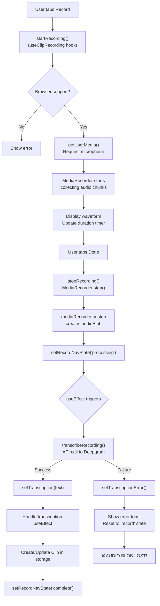
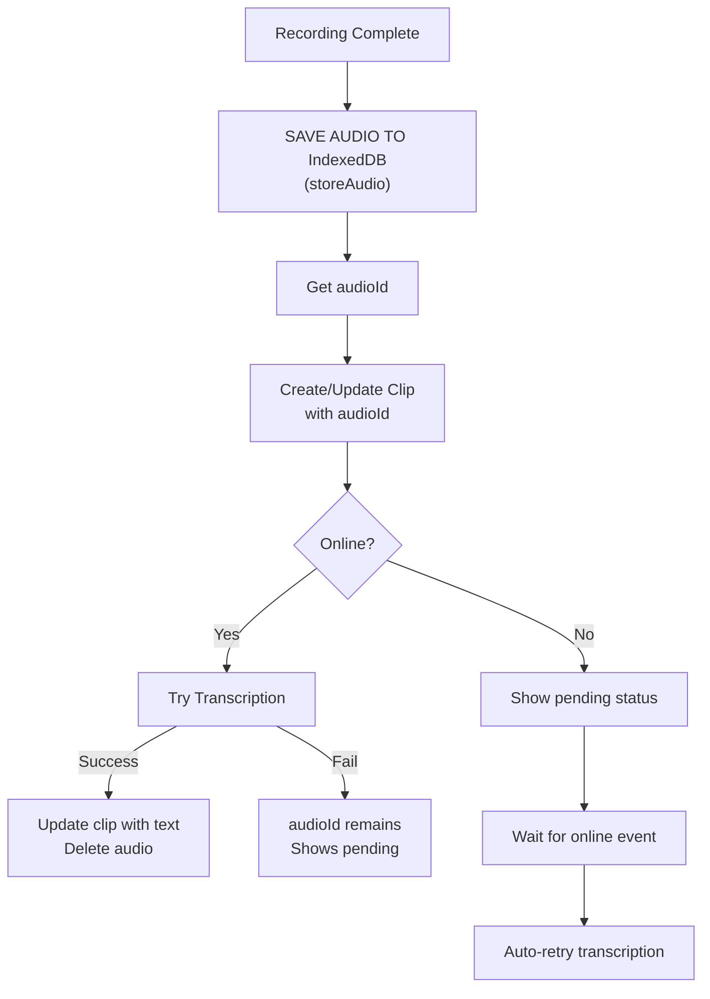

# Recording System Architecture Analysis

## Current System Overview

The current system is **NOT robust for offline scenarios**. Here's exactly how it works:

---

## Current Recording Flow



---

## State Machine

| State | NavBar Shows | What's Happening |
|-------|--------------|------------------|
| `record` | Record button | Ready to record |
| `recording` | Stop button + timer | MediaRecorder active |
| `processing` | Spinner | Transcription API call in progress |
| `complete` | Copy + Record + Structure | Transcription done, clip saved |

**Transition Logic:**
- `record` → `recording`: User taps record
- `recording` → `processing`: User taps done (audioBlob created)
- `processing` → `complete`: `transcription` state populated
- Any → `record`: Error occurs OR user starts new recording

---

## What Gets Stored Currently

| Data | Where | When |
|------|-------|------|
| **Audio Blob** | ❌ NOT STORED | Lives in React state only |
| **Raw Text** | sessionStorage (Clip.rawText) | After transcription success |
| **Formatted Text** | sessionStorage (Clip.formattedText) | After AI formatting |
| **Clip Metadata** | sessionStorage | After transcription success |

**Critical Gap:** Audio only exists in memory. If transcription fails, audio is LOST.

---

## The 4 Offline Scenarios

### Scenario 1: Start Offline, Stay Offline
```
User is offline → Records → Taps Done
```
**Current behavior:**
- `transcribeRecording()` called
- API fetch fails immediately
- `transcriptionError` set
- Error toast shown
- ❌ **Audio blob lost**

### Scenario 2: Start Online, Go Offline Before Done
```
User is online → Records → Goes offline → Taps Done
```
**Current behavior:**
- Same as Scenario 1
- `navigator.onLine` not checked
- API call attempted anyway
- Fails after timeout or immediate network error
- ❌ **Audio blob lost**

### Scenario 3: Offline, Come Online
```
User was offline → Comes online
```
**Current behavior:**
- ❌ Nothing happens
- No listener for `online` event
- Even if audio was somehow saved, no retry mechanism

### Scenario 4: Online, Bad Network
```
User is online → Records → Network is slow/intermittent → Taps Done
```
**Current behavior:**
- `transcribeRecording()` starts
- fetch() hangs or times out
- Eventually fails
- ❌ **Audio blob lost**

---

## Key Gaps in Current Architecture

### 1. No Audio Persistence
```typescript
// Current: Audio only in React state
const [audioBlob, setAudioBlob] = useState<Blob | null>(null);

// Should be: Saved to IndexedDB immediately
mediaRecorder.onstop = async () => {
  const blob = new Blob(chunksRef.current, { type: mimeType });
  const audioId = await storeAudio(blob); // ← Missing
  setAudioBlob(blob);
}
```

### 2. No Network Check Before Transcription
```typescript
// Current: Blindly tries API
useEffect(() => {
  if (audioBlob && ...) {
    transcribeRecording(); // ← No network check
  }
}, [...]);

// Should be: Check first
if (navigator.onLine) {
  transcribeRecording();
} else {
  markAsPending(audioId);
}
```

### 3. No Retry on Error
```typescript
// Current: Just shows error
useEffect(() => {
  if (transcriptionError) {
    setShowErrorToast(true); // ← No save, no retry
    setRecordNavState('record');
  }
}, [transcriptionError]);

// Should be: Save for later
if (transcriptionError && audioId) {
  // Audio already saved, mark as pending
  updateClip(clipId, { audioId, status: 'pending' });
}
```

### 4. No Reconnection Listener
```typescript
// Missing entirely:
useEffect(() => {
  const handleOnline = async () => {
    const pending = getClipsWithAudioId();
    for (const clip of pending) {
      await transcribePending(clip);
    }
  };
  window.addEventListener('online', handleOnline);
}, []);
```

---

## What Needs to Change

### Audio-First Architecture



### Key Principle
**Audio is saved IMMEDIATELY when recording stops.** Before any network call. This is the nuclear option - your recording can never be lost.

---

## Implementation Checklist

1. [ ] Modify `useClipRecording.stopRecording()` to save audio to IndexedDB
2. [ ] Add `audioId` to Clip interface (already done)
3. [ ] Check `navigator.onLine` before transcription
4. [ ] Add `online` event listener for retry
5. [ ] Show pending state for clips with `audioId`
6. [ ] Delete audio from IndexedDB after successful transcription
